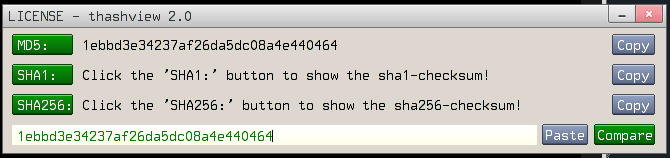

# TinyHashView

### Description:

**TinyHashView is a small window utility built for KolibriOS.**

- Support for three checksum algorithms: MD5, SHA1, SHA256.
- Shows checksums of the file.
- It is possible to compare checksums.(NEW)

### Compilation:

**This program is almost entirely created in KolibriOS (I am a supporter of software development using the tools of the OS itself). So use TCC to compile or just run the "build_kex.sh" script to build it automatically.**

    tcc algorithms/md5.c algorithms/sha1.c algorithms/sha256.c thashview.c -o thashview -lck
    
**It is also possible to build my program in Linux and Windows using the SDK and Serge's toolchain. You can use my packages for Linux: [kos32-sdk]("https://github.com/turbocat2001/kos32-sdk-bin") **

*For Linux:*

    make

*For Windows:*
    
    build_kex_kossdk.bat   
    
### Usage example:

**Open the file with "thashview" in EOLITE or run it in "SHELL**
    
    thashview filename

### Whats is done

- Changed and corrected interface.
- Added copy to clipboard function.
- Added the function of pasting from the clipboard.
- Implemented input field(Not full functionality).
- Added "Compare" button to compare checksums.
- Display notifications when copying, pasting, etc.

### My plans
 
- Expand the functionality of the input field.
- Add a dialog box to open a file. 
- Fix still undetected bugs. 
- Integration with EOLITE (questionable).

### I thank
- Maxim Kuzmitski (maxcodehack) for drawing the icon, helping with the design, and creating a makefile for building for Linux.
- Rustem Gimadutdinov (rgmad) for testing and script creation for Windows.
- Bopann Kostoev (Boppan) for finding bugs.

   
